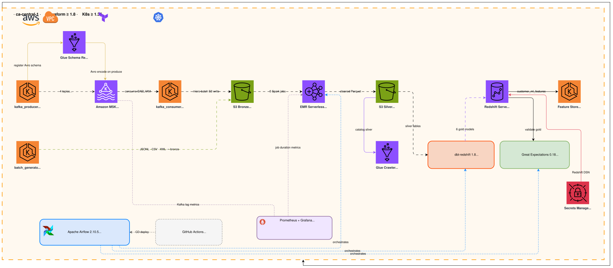
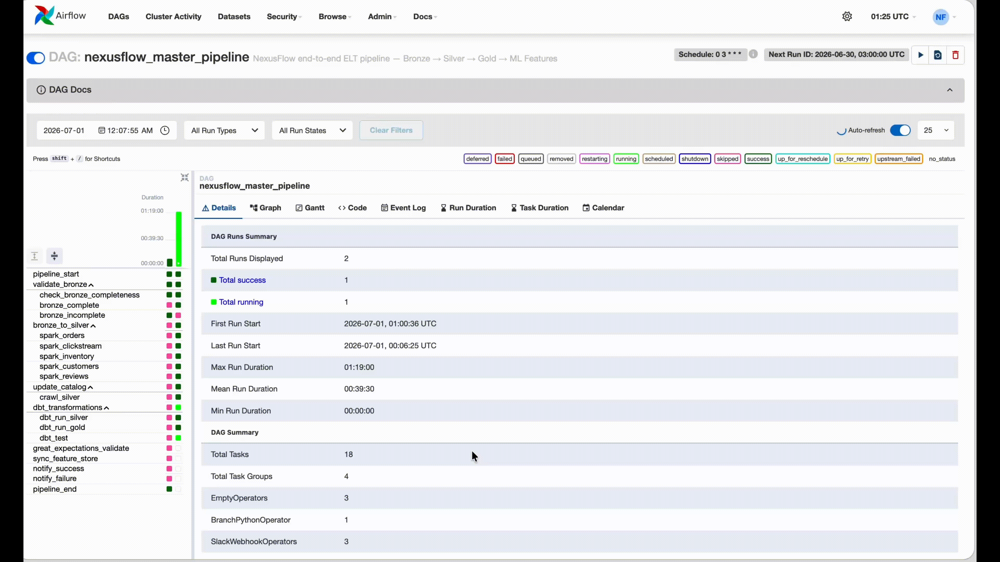
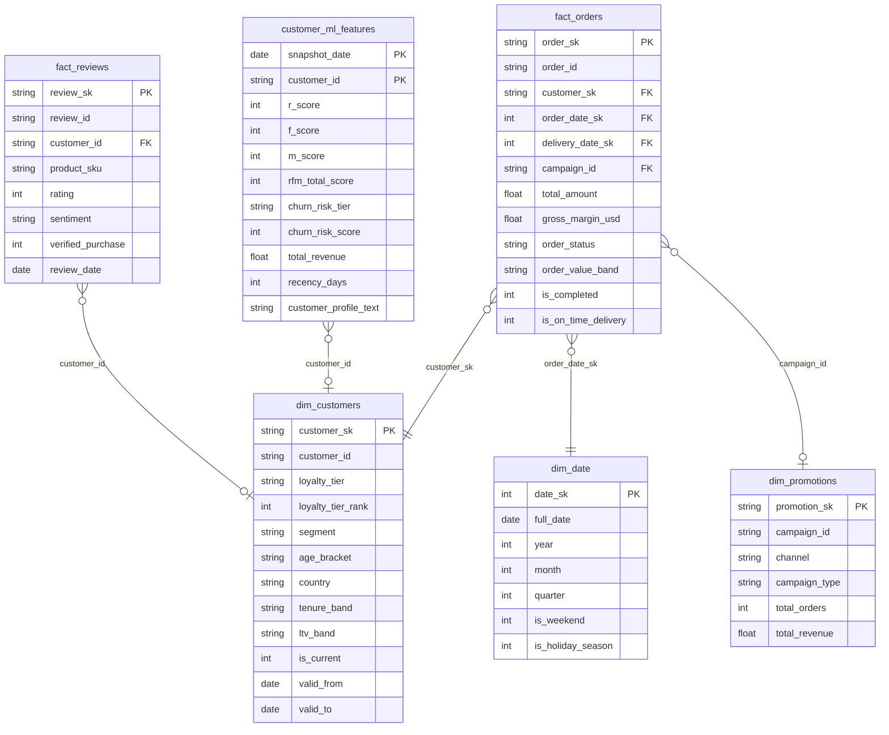

# NexusFlow DataOps Pipeline

> Production-grade e-commerce DataOps pipeline on AWS — streaming + batch ingestion, medallion lakehouse, serverless compute, dbt transformations, automated quality gates, and full IaC.

[](https://github.com/smitshah/NexusFlow-DataOps-Pipeline/actions)
[](LICENSE)


---

## Architecture



```
Producers (EKS pods)
    │  5 Kafka topics (JSON · CSV · Avro · XML · Parquet)
    ▼
Amazon MSK (Kafka 3.x, SASL/IAM)
    │  Kafka Connect S3 Sink
    ▼
S3 Bronze (raw partitioned by date)
    │  Apache Spark — EMR Serverless
    ▼
S3 Silver (cleaned, typed, partitioned Parquet)
    │  dbt-redshift transformations
    ▼
Redshift Serverless (Gold: facts · dims · ML features)
    │  Great Expectations validation
    ▼
Feature Store sync  ·  Grafana dashboards
```

---

## Tech Stack

| Layer | Technology |
|---|---|
| Orchestration | Apache Airflow 2.10.5 (Helm on EKS, git-sync DAGs) |
| Streaming | Amazon MSK (Kafka 3.x), Kafka Connect S3 Sink |
| Schema Registry | AWS Glue Schema Registry (Avro — clickstream) |
| Batch Compute | EMR Serverless (Spark 3.5 / Scala 2.12) |
| Storage | S3 medallion — bronze / silver / gold |
| Transformation | dbt-redshift 1.8 |
| Analytical DB | Redshift Serverless |
| Data Quality | Great Expectations 0.18 (runs in Airflow scheduler pod) |
| Container Runtime | EKS 1.35, IRSA for AWS auth |
| IaC | Terraform 1.8 |
| CI/CD | GitHub Actions — PR gate CI + manual dispatch CD |
| Monitoring | Prometheus + Grafana (kube-prometheus-stack Helm) |
| Secret Management | AWS Secrets Manager + EKS IRSA (no static credentials) |

---

## Data Sources & Formats

Five ingestion formats, all flowing through MSK:

| Topic | Format | Source | Notes |
|---|---|---|---|
| `orders` | JSON | `kafka_producer.py` | transactional orders |
| `clickstream` | **Avro** | `kafka_producer.py` | Glue Schema Registry wire encoding |
| `inventory-events` | CSV | `kafka_producer.py` | inventory snapshots |
| `product-reviews` | XML | `batch_generator.py` | daily XML file upload |
| `user-sessions` | Parquet | `kafka_producer.py` | session telemetry |
| `dlq-orders` | JSON | dead-letter queue | failed order events |

Batch data (customers JSONL, inventory CSV, reviews XML) written to S3 bronze directly by the `nexusflow-batch-generator` CronJob.

---

## Pipeline DAG



DAG ID: `nexusflow_master_pipeline` — runs daily, triggered at 06:00 UTC.

```
pipeline_start
├── validate_bronze [check_bronze_completeness → bronze_complete / bronze_incomplete]
├── bronze_to_silver
│   ├── spark_orders
│   ├── spark_clickstream
│   ├── spark_inventory
│   ├── spark_customers
│   └── spark_reviews          ← spark-xml_2.12:0.18.0 package
├── dbt_transformations
│   ├── dbt_run_silver
│   ├── dbt_run_gold
│   └── dbt_test
├── great_expectations_validate
├── update_catalog [crawl_silver]
├── sync_feature_store
└── pipeline_end  →  notify_success / notify_failure
```

**EMR Serverless Spark config** (all 5 jobs):
- `executor.instances=1`, `dynamicAllocation.maxExecutors=2`
- Capacity ceiling: 5 jobs × 3 executors × 1 core = 15 vCPU ≤ 16 vCPU app cap

---

## Data Model (Gold Layer)

Star schema in Redshift Serverless. Silver intermediates: `silver_orders`, `silver_customers`, `silver_clickstream`, `silver_reviews`.



`customer_ml_features` also joins `silver_clickstream` for browse/engagement signals and exposes `customer_profile_text` for LLM/RAG injection.

---

## Project Structure

```
NexusFlow-DataOps-Pipeline/
├── airflow/dags/                   # Airflow DAG definitions (git-synced)
├── dbt_project/
│   ├── models/
│   │   ├── silver/                 # Cleaned + typed models
│   │   └── gold/                   # fact · dim · ml_features
│   └── profiles.yml
├── great_expectations/             # GE suites + config (runs on Redshift gold)
├── kubernetes/
│   ├── airflow/values.yml          # Helm values — ECR_REGISTRY / ACCOUNT_ID placeholders
│   ├── datagen/deployment.yml
│   ├── kafka/kafka-connect-deployment.yml
│   └── dbt/cronjob.yml
├── monitoring/
│   └── prometheus/rules/nexusflow_alerts.yml
├── scripts/
│   ├── deploy/full_deploy.sh       # Single-command deploy (steps 4–13, --from STEP resume)
│   └── teardown/destroy.sh         # Pre-destroy cleanup then terraform destroy
├── src/
│   ├── airflow/                    # Custom Airflow image — provider deps + GE + great_expectations/ baked in
│   ├── datagen/                    # kafka_producer.py (streaming, 5 topics) · batch_generator.py (S3 bronze direct)
│   ├── ingestion/                  # kafka_consumer.py (MSK SASL/IAM) · s3_writer.py (bronze S3 sink)
│   ├── processing/                 # bronze_to_silver.py — EMR Serverless Spark entrypoint, uploaded to S3
│   ├── serving/                    # FastAPI endpoint exposing customer_ml_features from Redshift
│   └── ml_features/                # dbt macros: mode_lookup_cte used by customer_ml_features.sql
└── terraform/environments/dev/     # All AWS infrastructure (VPC, EKS, MSK, EMR, Redshift)
```

---

## Prerequisites

- AWS account with programmatic access (`AWS_ACCESS_KEY_ID`, `AWS_SECRET_ACCESS_KEY`, `AWS_DEFAULT_REGION=ca-central-1`)
- Tools: `terraform >= 1.8`, `kubectl`, `helm`, `aws-cli v2`, `docker` (buildx for `linux/amd64`), `python3`
- Docker Desktop running (needed for multi-arch builds)
- Sufficient AWS quotas: 16 vCPU EMR Serverless, EKS m5.xlarge nodes, MSK `kafka.m5.large`

---

## Security & IAM

No static AWS credentials anywhere in the system. All pod-to-AWS authentication uses **IRSA** (IAM Roles for Service Accounts) — each Kubernetes service account maps to a dedicated IAM role via the EKS OIDC provider.

| Service Account | IAM Role | Key Permissions |
|---|---|---|
| `airflow-scheduler` / `airflow-webserver` | `nexusflow-dev-airflow-irsa` | EMR Serverless submit, S3 read/write, Redshift Data API, Secrets Manager read |
| `nexusflow-datagen-sa` | `nexusflow-dev-app-irsa` | MSK produce, S3 bronze write, Glue Schema Registry read/write |
| `nexusflow-ingestion-sa` | `nexusflow-dev-app-irsa` | MSK consume, S3 bronze write |
| `nexusflow-dbt-sa` | `nexusflow-dev-dbt-irsa` | Redshift Data API, S3 read |
| `nexusflow-serving-sa` | `nexusflow-dev-app-irsa` | Redshift Data API, S3 gold read |

**MSK auth:** SASL/IAM — Kafka clients use AWS SDK credential chain; no Kafka username/password.

**Avro schema auth:** Glue Schema Registry accessed via IRSA. Producers auto-register schemas; consumers auto-resolve. No registry API key.

**Redshift access:** VPC-only endpoint — no public connectivity. All workloads reach Redshift via the Redshift Data API from within the EKS VPC. No direct JDBC from outside.

**Secrets:** Redshift DSN stored in AWS Secrets Manager. Injected at pod start via IRSA; never mounted as plain-text env var or committed to git.

---

## Deploy

Single command — handles ECR build, EKS provisioning, MSK, Redshift, Airflow Helm install, DAG wiring:

```bash
bash scripts/deploy/full_deploy.sh
```

Resume from a specific step after partial failure:

```bash
bash scripts/deploy/full_deploy.sh --from 8
```

Steps: `4 5 6 7 7.5 8 8.5 8.55 8.6 8.7 8.8 8.9 8.10 9 9.5 10 10.5 11 12 13`

> **Note:** `kubernetes/*.yml` files use `ECR_REGISTRY` and `ACCOUNT_ID` placeholders — `full_deploy.sh` substitutes them at deploy time via `sed`. Do not commit the substituted values.

**Trigger pipeline manually after deploy:**

```bash
# Seed bronze layer
kubectl create job batch-seed-$(date +%s) \
  --from=cronjob/nexusflow-batch-generator -n kafka

# Trigger DAG
airflow dags trigger nexusflow_master_pipeline
```

---

## CI/CD


| Workflow | Trigger | Steps |
|---|---|---|
| `NexusFlow CI` | Pull Request | lint · pytest · dbt compile · GE suite check |
| `NexusFlow Deploy` | `workflow_dispatch` | docker build + push → kubectl apply |

---

## Data Quality

Great Expectations runs inside the Airflow scheduler pod (`great_expectations_validate` task) against Redshift gold tables post-dbt.

Suites validate: `fact_orders`, `fact_reviews`, `dim_customers`, `customer_ml_features`.

Results stored in `s3://nexusflow-dev-artifacts/ge-results/`.

Alerts fire via Prometheus rules in `monitoring/prometheus/rules/nexusflow_alerts.yml`:
- `DataFreshnessWarning` — data stale > 6h
- `DataFreshnessCritical` — data stale > 24h
- `KafkaProducerDown` — producer pod unreachable > 5m

---

## Monitoring


Grafana + Prometheus deployed via `kube-prometheus-stack` Helm chart in `monitoring` namespace.

Access: `kubectl port-forward svc/kube-prometheus-grafana 3000:80 -n monitoring`

---

## Cost Estimate

Serverless-first architecture — pay only when pipeline runs.

**Deployed (dev) config:**

| Component | Instance / Model | Est. cost/day | Notes |
|---|---|---|---|
| EKS node group | `t3.medium × 3` | ~$3.74/day | desired_size=3; 1 caused OOM for Airflow scheduler, 2 had no headroom for batch Jobs |
| MSK brokers | `kafka.t3.small × 3` | ~$2.74/day | sufficient for dev throughput; scale to `kafka.m5.large` for prod |
| EMR Serverless (5 Spark jobs) | per vCPU-hr + GB-hr | ~$0.16/run | pay-per-use; $0 between runs |
| Redshift Serverless | per RPU-hr | ~$0.20 idle | scales to 0 RPU when idle |
| S3 (bronze + silver + gold) | per GB stored | <$0.10/day | dev data volumes |
| **Total (dev)** | | **~$6.84/day** | |

**Original plan vs actual choice — EKS node group:**

| Option | Config | Cost/day | Outcome |
|---|---|---|---|
| Original plan | `m5.xlarge × 2` | ~$10.75/day | Airflow + monitoring fit; cost was top expense item ($7.02 of $17.6 over 5-day test) |
| Attempted | `t3.medium × 1` | ~$1.25/day | Failed — scheduler OOM (`83%` allocatable mem consumed by Airflow stack alone) |
| Attempted | `t3.medium × 2` | ~$2.49/day | Failed — no headroom for one-shot batch Jobs |
| **Deployed** | **`t3.medium × 3`** | **~$3.74/day** | Fits full stack + batch headroom; **~65% cheaper than m5.xlarge × 2** |

**EMR Serverless vs always-on EMR cluster (m5.xlarge):** ~$0.16/run vs ~$10.75/day — pay-per-run wins decisively for daily scheduled workloads.

---

## Teardown

```bash
# Step 1: pre-destroy cleanup (empty S3, stop EMR app, remove Helm, delete namespaces)
bash scripts/teardown/destroy.sh

# Step 2: destroy all infrastructure
cd terraform/environments/dev
terraform destroy
```

> **Warning:** `terraform destroy` deletes EKS, MSK, Redshift Serverless, EMR Serverless, VPC, and IAM roles. S3 buckets are emptied by `destroy.sh` first. ECR repos persist post-destroy (no force_destroy).

If `terraform destroy` fails with `Application must be in [STOPPED, CREATED]`:

```bash
aws emr-serverless stop-application \
  --application-id <APP_ID> --region ca-central-1

# Wait for STOPPED
while true; do
  STATE=$(aws emr-serverless get-application \
    --application-id <APP_ID> --region ca-central-1 \
    --query application.state --output text)
  echo "$(date +%T) $STATE"
  [[ "$STATE" == "STOPPED" || "$STATE" == "CREATED" ]] && break
  sleep 10
done

terraform destroy
```

---

## License

MIT — see [LICENSE](LICENSE).
